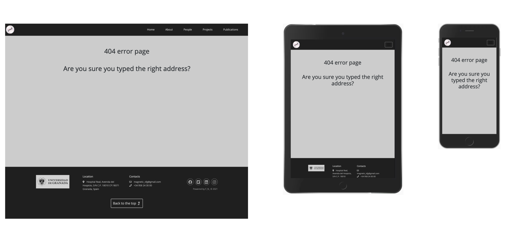

<h1 align="center">Magnetic Soft Matter Group</h1>

[View the live project here](https://frankn88.github.io/MS2_University-Research-Group/)

[View the testing information here - (TESTING.md) ](TESTING.md)

## Table of contents
1. [Introduction](#Introduction)
2. [UX](#UX)
    1. [UX - User Stories](#User-Stories)
      - [First Time Visitor Goals](#First-Time-Visitor-Goals)
      - [Returning Visitor Goals](#Returning-Visitor-Goals)
      - [Frequent User Goals](#Frequent-User-Goals)
      - [Site Owner Goals](#Site-Owner-Goals)
    2. [Strategy](#Strategy)
    3. [Scope](#Scope)
    3. [Structure](#Structure)
    4. [Skeleton](#Skeleton)
    5. [Surface](#Surface)
3. [Features](#Features)
    1. [Design Features](#Design-Features) 
    2. [Features to Implement in the future](#Features-to-Implement-in-the-future)
4. [Issues and Bugs](#Issues-and-Bugs)
5. [Technologies Used](#Technologies-Used)
     1. [Languages Used](#Languages-Used)
     2. [Frameworks, Libraries & Programs Used](#Frameworks,-Libraries-&-Programs-Used)
6. [Testing](#Testing)
     1. [Testing.md](TESTING.md)
7. [Deployment](#Deployment)
     1. [Deploying on GitHub Pages](#Deploying-on-GitHub-Pages)
     2. [Forking the Repository](#Forking-the-Repository)
     3. [Creating a Clone](#Creating-a-Clone)
8. [Credits](#Credits)
     1. [Content](#Content)
     2. [Media](#Media)
     3. [Code](#Code)
9. [Acknowledgements](#Acknowledgements)
***

## Introduction
This comprehensive website has been designed for the University Research Group "Magnetic Soft Matter Group" of the University of Granada (Spain). 
It is designed to be responsive and accessible on a range of devices, making it easy to navigate for potential students and partners.
The purpose of the site is to create an online presence allowing researchers and students in general, to find out relevant information about the place, its main research releases, professors' background and events. 
"Magnetic Soft Matter Group" is a new international research group that operates in Granada (Spain) in the field of Bioengineering.
This is the second of four Milestone Projects that the developer must complete during their Full Stack Web Development Program at The Code Institute. 
The main requirement is to make an interactive front-end website using primarily **HTML5**, **CSS3** and **JavaScript**.

## User Experience (UX)

-   ### User stories

    -   #### First Time Visitor Goals
        1. As a First Time Visitor, I want to easily understand the main purpose of the site and learn more about the University Research Group and its main features.
        2. As a First Time Visitor, I want to be able to easily navigate throughout the site to find content,research and researchers.
        3. As a First Time Visitor, I want to find the main areas of the research group. I also want to locate their social media links to see their followings on social media in order to be updated about their latest releases.

    -   #### Returning Visitor Goals
        1. As a Returning Visitor, I want to find information about new releases and events/seminars.
        2. As a Returning Visitor, I want to find the best way to get in contact with the organisation with any question I may have.
        3. As a Returning Visitor, I want to find the social media links so that I can join and interact with others in the community.

    -   #### Frequent User Goals
        1. As a Frequent User, I want to check to see if there are any newly added features regarding the research.
        2. As a Frequent User, I want to check to see if there are any updates to the staff and seminars.
        3. As a Frequent User, I want to sign up to the Newsletter so that I am emailed any major updates and/or releases or notified about special events and seminars.

    -   #### Site Owner Goals
        1. Increasing the overall group reputation and awareness of the team and related releases.
        2. Give an immediate overview of the research, its main applications, releases and other important information.
        3. Increase percentage of website visits in order to gain more popularity among the community.
        4. Gain a better understanding of the audience by checking their feedback both via the website and social networks.
        5. Consequently, increase social mentions and post with regularity in order to keep attention high.
        6. Allow potential students and entrepreneurs  to fill out a contact form, sign up for the email list, visit the physical location, or simply get in touch with the team.
        7. Make the website as accessible and responsive as possible.
        8. Allow external stakeholders to check out the competence of each single member of the team.
        9. Increase chances of future cooperations and projects.
        10. Use reviews to increase customer satisfaction.

#### Strategy
The website will focus on the following target audiences:

- **Roles:**
   - Current students and researchers
   - Future students and researchers 
   - Stakeholders and interested entrepreneurs
- **Demographic:**
   - Post graduate students
   - PHDs and professors
   - Whoever is interested in this research area both for academic and business reasons

The website needs to enable the **User** to retrieve desired information, including:
- Information about current research
- Information about future research
- Information about the research group components and their qualifications
- Upcoming seminars/events
- Contact information (standard and social enquires)

The website needs to enable the **Research group** to:
- Develop an online presence 
- Provide an easily navigable website for users to find relevant information about:
  - New members/research
  - Provide a channel of communication for enquires (via the form or social media)
  - Provide a channel of communication for new and current stakeholders (Social Links - easily accessible throughout the site with a click)
  - Show the individual skills of each component of the unit and the overall competence of the group.

#### Scope
In order to identify what features had to be included, the scope was deifined based on the previously defined strategy. This was broken into two categories:

- **Content Requirements**
 - The user will be looking for:
  - General information
  - New features
  - Feedback
  - Contact details
  - Social links

- **Functionality Requirements**
 - The user will be able to:
   - Easily navigate through the site in order to find the information they want
 - Be able to find links to external sites in order to:
   - Verify the status of the place
   - Find directions
   - Be constantly updated about news
   - Contact the desired team members directly through the individual contact details or contact form

#### Structure
The information architecture was organized in a fluid and clear way in order to ensure that users could navigate through the site with ease and efficiency.

#### Skeleton 
Wireframe mockups were created in a [Figma Workspace](assets/final_wireframes).
Unlike for the first MS, the PDF file generated by FIGMA was not loading correctly onto the portal. To best resolve this issue i have created a png file for the wireframe of each page and added them singularly into a separate folder.
Several style changes were made in the final project compared to the inital wireframe on Figma. Those changes were mainly related to the choice of different pictures to better suit the new layout and Bootstrap features, colours, font size, positioning on the page; all aimed at providing the best user experience and responsiveness.

**Pages:**
 1. Home Page:

 2. About
 

 3. People
 

 4. Projects
 

 5. Publications
 

 6. Page 404
 

### Surface

#### Colour Scheme
  - The main colours used throughout the website are a mixture of dark gray, opaque white (as a clear and non-invasive contrast colour to the previous one), and black fonts. That combination of colours has a classic, professional and non invasive effect on the user. At the same time, when needed, a theme of bright colours provide the right dynamism by appearing near features that need to be highlighted (i.e. gallery and progress bars).

#### Typography
  -   The "Open sans" font is the main font used throughout the whole website with "Roboto" as the fallback font in case, for any reason, the font won't be imported into the site correctly. 

#### Imagery
  -   Imagery is extremely important in websites that aim to show the reliability of a research group. It is designed to be striking and catch the user's attention. The carousel on the homepage is an immediate example of an element that catches the attention of the user with the most important technologies and staff.
  - It also has a smart and simple aesthetic. The imagery has been thought about carefully to draw the attention of the user straight to the main components of the website.
  - Ther user can visualise each component of the group thanks to the pictures in "People" page.

## Features

### Design Features
Each page of the website features a consistent responsive navigational system:
- The **Header** contains a conventionally placed **logo** at the top left of the page (clicking this will redirect users back to the home page) and **navigation bar** at the top right of the page.
- On smaller screens, the navigation bar collapses into a **toggler** icon whereby clicking it will reveal the links to the other pages.
- The **Footer** contains the appropriate **social media icons**, linking users to the main social media pages of the research group and university logo (clicking this will redirect users back to the univesity official page). Also the address in the footer works as a link to the university in Google Maps.
- In the footer, there are respectively a mailto and a callto embedded in the email and number.
- **Back to the top button**  - Those <strong>buttons</strong> are present in the footer so that the user can comfortably click them to be redirected to the top of the page. This feature improves the quality of navigation, especially if using smartphones.

<dl>
  <dt><a href="index.html" target="_blank" alt="Research group Home Page">Home Page</a></dt>
  <dd>The Home Page consists of the following elements:
     <ul>
          <li><strong>Introductory Jumbotron with title</strong> - Occupies 100% of the page width, from the left to the right, while being viewed on all devices. It introduces the page the user is checking with a short title and a blurred background that changes for every page.
          </li>
          <li><strong>Hero Image/carousel</strong> - Occupies 100% of the page width, from the left to the right, while being viewed on all devices. The imagery used was specifically chosen as it created an impactful first impression of the technologies used.
          </li>
          <li><strong>Descriptive Cards</strong> - Taking 80% of the page width, from left to right, while being viewed on a desktop. On mobile and tablet devices, the descriptive cards responsively positions vertically, underneath the <strong>Carousel</strong>. The purpose of the card list is to show immediately part of the staff with a little description.
          </li>
          <li><strong>Jumbotron and Button</strong> - Strategically positioned between the cards, a jumbotron with a blurred background immediately convey the attention to a button that leads the user to the people's page.
          </li>
     </ul>
  </dd>
  <dt><a href="about.html" target="_blank" alt="About Page">About Page</a></dt>
  <dd>The About page consists of the following elements:
     <ul>
          <li><strong>Introductory Jumbotron with title</strong> - Occupies 100% of the page width, from the left to the right, while being viewed on all devices. It Introduces the page the user is checking with a short title and a blurred background that changes for every page.
          </li>
          <li><strong>Hero Image</strong> - Occupying about 80% of the page, this hero image shows the group together.
          </li>
          <li><strong>Contact Form</strong> - A little introduction followed by a working contact form. The user can contact the team with this form and fill out a message. The form is connected to EmailJS API.
          </li>
          <li><strong>Map</strong> - An iframe containing a map clearly shows the position of the university.
          </li>
     </ul>
  </dd>
  <dt><a href="people.html" target="_blank" alt="People Page">People Page</a></dt>
  <dd>The people page consists of the following elements:
     <ul>
          <li><strong>Introductory Jumbotron with title</strong> - Occupies 100% of the page width, from the left to the right, while being viewed on all devices. It Introduces the page the user is checking with a short title and a blurred background that changes for every page.
          </li>
          <li><strong>Cards list</strong> - Occupying most of the page, this ordered card list shows every single component of the team and a very brief description of the role he/she has in the group. The cards are totally responsive and position vertically if visualised in smaller devices.
          </li>
          <li><strong>Dynamic Gallery</strong> - this dynamic gallery was built using JS and aims to show part of the staff in a cool way so that the user can click and visualise. 
          Once again, an element intended to catch the user's attention and increase curiosity.
          </li>
     </ul>
  </dd>
  <dt><a href="projects.html" target="_blank" alt="Projects Page">Projects Page</a></dt>
  <dd>The projects page consists of the following elements:
     <ul>
          <li><strong>Introductory Jumbotron with title</strong> - Occupies 100% of the page width, from the left to the right, while being viewed on all devices. It Introduces the page the user is checking with a short title and a blurred background that changes for every page.
          </li>
          <li><strong>Clock</strong> - A clock positioned on top of the quiz div shows the real time of the location the user is in.
          </li>
          <li><strong>Quiz</strong> - Science based quiz. This quiz has been created to entertain the user while waiting. The questions show immediately if they have been answered correctly or not and at the end give a feedback with a percentage.
          </li>
          <li><strong>Weather app</strong> - A simple weather app with an input will idicate the temperature together with the main weather phenomena when the user inserts the name of the desired location.
          </li>
     </ul>
  </dd>
  <dt><a href="publications.html" target="_blank" alt="Publications Page">Publications Page</a></dt>
  <dd>The Publications page consists of the following elements:
     <ul>
          <li><strong>Introductory Jumbotron with title</strong> - Occupies 100% of the page width, from the left to the right, while being viewed on all devices. It Introduces the page the user is checking with a short title and a blurred background that changes for every page.
          </li>
          <li><strong>Images with links</strong> - Those six images are connected to external links leading to scientific magazines.
          </li>
          <li><strong>Publications</strong> - Detailed list of publications, year after year, connected to the respective link on the scientific platforms.
          </li>
          <li><strong>Progress Bar</strong> - This dynamic progress bar diagram shows the main macro areas of research with the related percentage.
          </li>
     </ul>
  </dd>
  </dl>

### Features to Implement in the future
  - A search area for the whole website in particular the events page would be a useful addition to add
  - A page for each component of the team with detailed individual projects
  - To use the EmailJS and OpenWeatherMapp APIs I had to include the API keys in the JS code. From a security perspective there should be no such exposure. As this is a frontend project, it was not in scope to have a backend part. However to implement the APIs correctly from a security perspective I would have like to have a backend element(node for example) and store those elements in the backend so it is not exposed at the frontend.

## Issues and Bugs 

The developer ran into a number of issues during the development of the pages.
The guiding approach in developing the website was the motto: "Mobile First". This aims to create better experiences for users by starting the design process from the smallest of screens: a mobile.

**Navbar issue** 
- An initial issue was the position (if opened from a small device) the button would take in relation to the logo. After a few trials it has been resolved by reducing the size of the logo.

**Logo issue** 
- The initial use of `%` instead of `px` to size the logo made the whole surface of the navbar cliccable. The use of the unit `px` resolved the situation. Now in the navbar only the logo can be clickable (together with the links) and the rest of the navbar is safe.

**Cookies Bug** 
- A responsive mistake related to the cookies was not noticed at the beginning. The cookies div would not respond well if visualised on small devices, pushing all of the other elements in an unnatural way. The use of Bootsrap's container class resolved that issue.

**Gallery Issue** 
- A great amount of time was dedicated to finding the most suitable style for a gallery that could be both responsive and aesthetically pleasing. After many trials, the best approach was a dynamic gallery made with JS that would respond to user inputs.

**Progress bar issue** 
- The elements in the progress bars would overlay one another. Sizing via CSS and enlarging the div resolved that issue and made it totally responsive.

**Form Issue** 
- The form is correctly working and sending emails. During the development of the page i have tried to build a function within the EmailJS one that would validate the inputs. As a result of that the form stopped working and i have therefore decided to go back to the original idea of using the "required" attribute to validate the empty fields.
The "required" attribute satisfies 100% the functionality i needed, therefore i have decided not to jeopardize the form function and leave it the way i had originally built it.

**HTML Validator-related resolved bugs**
- Some missing "alt" attributes to the  tags.
- Incorrect spacing in the phone number in the footer.
- One missing closing tag.

**CSS Validator-related resolved bugs**
- No bugs found.

### Known existing bugs
- Occasional use of `!important` to override Boostrap features.
- People page tends to load slightly slower than the other pages. That is due to the many images present on the page. All of the images have been resized and compressed but that still affects a bit the speed in loading if compared to the other pages.
- For detailed testing information please check: [TESTING.md](TESTING.md "Link to testing file")

## Technologies Used

### Languages Used
-   [HTML5](https://en.wikipedia.org/wiki/HTML5)
-   [CSS3](https://en.wikipedia.org/wiki/Cascading_Style_Sheets)
-   [JavaScript](https://en.wikipedia.org/wiki/JavaScript)

### Frameworks, Libraries & Programs Used
1. [Bootstrap 4.6:](https://getbootstrap.com/docs/4.6/getting-started/introduction/)
    - Bootstrap was used to assist with the responsiveness and styling of the website.
1. [Tiny png:](https://tinypng.com/)
    - Tiny png was used to compress all of the images.
1. [Google Fonts:](https://fonts.google.com/)
    - Google fonts were used to import the fonts.
1. [Font Awesome:](https://fontawesome.com/)
    - Font Awesome was used on all pages throughout the website to add icons for aesthetic and UX purposes.
1. [Git](https://git-scm.com/)
    - Git was used for version control by utilizing the Gitpod terminal to commit to Git and Push to GitHub.
1. [GitHub:](https://github.com/)
    - GitHub is used to store the projects code after being pushed from Git.
1. [Favicon:](https://favicon.io/)
    - Favicon was used to create the icon.
1. [Figma:](https://www.figma.com/login)
    - Figma was used to create the [wireframes](assets/testing_files/figma_wireframe/wireframe_figma-compressed.pdf) during the design process.
1. [Unsplash:](https://unsplash.com/)
    - Unsplash was used to download pictures based on the specific features of each page, intended orientation of the images in the pages and best match with bootstrap elements.
1. [Canva:](https://www.canva.com/design/)
    - Canva was used to create the logo.
1. [Markdown Guide:](https://www.markdownguide.org/basic-syntax/)
    - Markdown Guide was used to check MD syntax.
1. [Adobe Acrobat - Compress PDF:](https://www.adobe.com/ie/acrobat/online/compress-pdf.html?promoid=C12Y2YQN&mv=other)
    - Adobe Acrobat was used to compress PDFs.
1. [jQuery:](https://jquery.com/)
    - JavaScript library.
1. [JSHint:](https://jshint.com/)
    - To detect errors and potential problems in the JavaScript code.
1. [EmailJS:](https://www.emailjs.com/)
    - To send email directly through JS.
1. [JSFiddle:](https://jsfiddle.net/)
    - JS Code Playground.
1. [Openweathermap:](https://openweathermap.org/api)
    - To access current weather data for any location.

## Testing
Testing information can be found in a separate testing [file](TESTING.md "Link to testing file")

## Deployment

### Deploying on GitHub Pages
To deploy this page to GitHub Pages from its GitHub repository, the following steps were taken:
1. Log into [GitHub](https://github.com/login "Link to GitHub login page") or [create an account](https://github.com/join "Link to GitHub create account page").
2. Locate the [GitHub Repository](https://github.com/FrankN88/FrankN88-xxxxxxxx "Link to GitHub Repo").
3. At the top of the repository, select Settings from the menu items.
4. Scroll down the Settings page to the "GitHub Pages" section.
5. Under "Source" click the drop-down menu labelled "None" and select "Master Branch".
6. Upon selection, the page will automatically refresh meaning that the website is now deployed.
7. Scroll back down to the "GitHub Pages" section to retrieve the deployed link.
8. At the time of submitting this Milestone project, the Development Branch and Master Branch are identical.

### Forking the Repository
By forking the GitHub Repository a copy of the original repository is made on the GitHub account. To view and/or to make  changes without affecting the original repository: 
1. Log into [GitHub](https://github.com/login "Link to GitHub login page") or [create an account](https://github.com/join "Link to GitHub create account page").
2. Locate the [GitHub Repository](https://github.com/FrankN88/FrankN88-xxxxxxxxxxxxx "Link to GitHub Repo").
3. At the top of the repository, on the right side of the page, select "Fork".
4. You should now have a copy of the original repository in your GitHub account.

### Creating a Clone
How to run this project locally:
1. Install the [GitPod Browser](https://www.gitpod.io/docs/browser-extension/ "Link to Gitpod Browser extension download") Extension for Chrome.
2. After installation, restart the browser.
3. Log into [GitHub](https://github.com/login/ "Link to GitHub login page") or [create an account](https://github.com/join "Link to GitHub create account page").
4. Locate the [GitHub Repository](https://github.com/FrankN88/FrankN88-MS2_University-Research-Group "Link to GitHub Repo").
5. Click the green "GitPod" button in the top right corner of the repository.
This will trigger a new gitPod workspace to be created from the code in github where you can work locally.
Click [Here](https://help.github.com/en/github/creating-cloning-and-archiving-repositories/cloning-a-repository#cloning-a-repository-to-github-desktop) to retrieve pictures for some of the buttons and more detailed explanations of the above process.

## Credits

### Content
-   References in the JS code related to the APIs.
-   Psychological properties of text colour in the README.md was found [here](http://www.colour-affects.co.uk/psychological-properties-of-colours)

### Media
- Some Images come from my personal archives
- All the other Images were downloaded from [Unsplash](https://unsplash.com/ "Link to Unsplash page").

### Code
The developer consulted multiple sites in order to better understand the code that they were trying to implement. The following sites were used on a more regular basis:
- [Stack Overflow](https://stackoverflow.com/ "Link to Stack Overflow page")
- [W3Schools](https://www.w3schools.com/ "Link to W3Schools page")
- [Bootstrap](https://getbootstrap.com/ "Link to BootStrap page")
- [MDN Web Docs](https://developer.mozilla.org/en-US/ "Link to MDN Web Docs")
- [jQuery](https://jquery.com/ "Link to jQuery page")

### Acknowledgements
- My mentor Mo Shami for continuous helpful feedback.
- Tutor support at Code Institute for their support.
- My family for opinions and feedback.